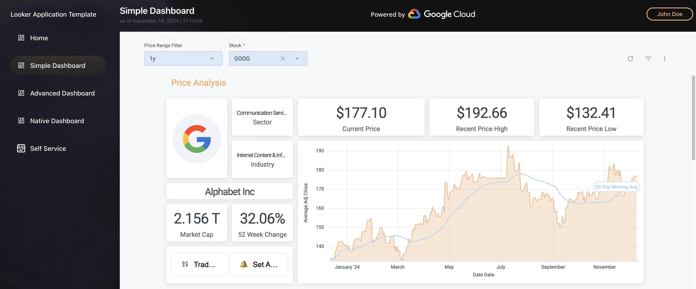
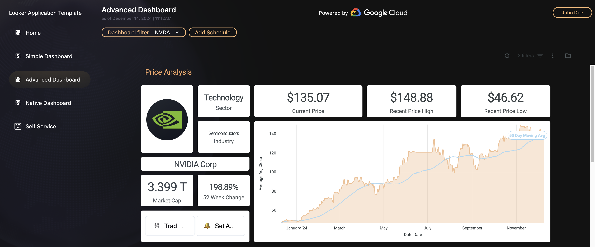
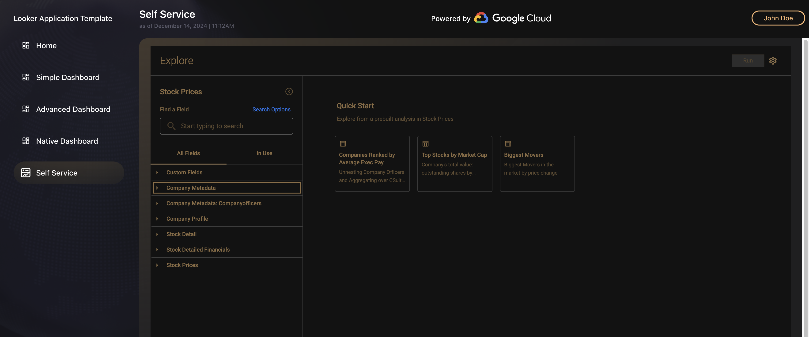
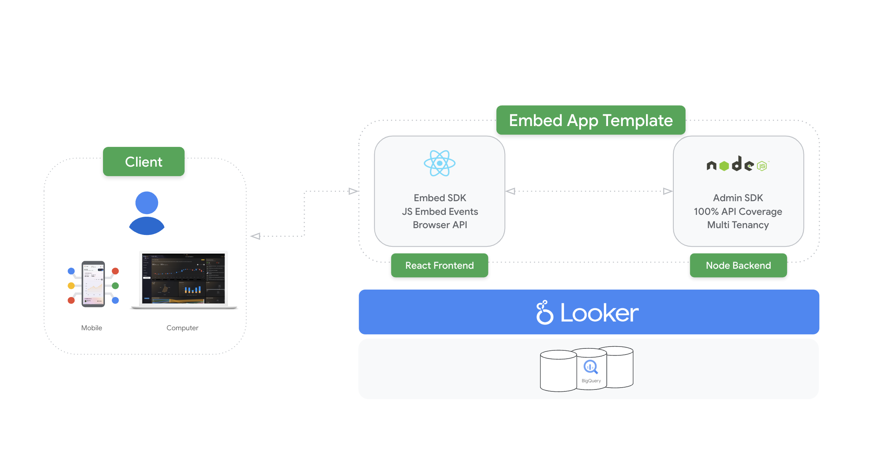

# Looker Embedded Analytics Application Template

## Introduction

The goal of this repository is to showcase how to implement a simple Embedded Analytics data application with Looker and Looker's developer tools, implemented in React and Node. The app leverages modern Looker design patterns in both the frontend and backend. Additionally it is able to display data from a Looker instance using two different methods:

- [iFrame] Embedding a looker dashboard using [Looker Embed SDK](https://developers.looker.com/embed/embed-sdk)
- [API] Using [Looker SDK](https://www.npmjs.com/package/@looker/sdk) to send custom queries to your Looker instance, and display results using custom visualizations

## Features Overview

### Simple Dashboard Embedding

**Source:** [`SimpleDashboard.jsx`](./src/components/SimpleDashboard/SimpleDashboard.jsx)

Basic dashboard embedding using Looker's Embed SDK. This feature demonstrates the foundational implementation of embedded analytics.

```javascript
LookerEmbedSDK.createDashboardWithId('your-dashboard-id')
  .appendTo('#dashboard-container')
  .build()
  .connect()
```

**Key Capabilities:**
- One-click dashboard embedding
- Default Looker theme integration
- Automatic responsive sizing
- Basic user authentication flow

[*Coming Soon*] Training: Simple Dashboard Implementation ↗️

### Advanced Dashboard with Events

**Source:** [`AdvancedDashboard.jsx`](./src/components/AdvancedDashboard/AdvancedDashboard.jsx)

Enhanced dashboard embedding with bi-directional JavaScript events, enabling interactive filtering and real-time updates.

```javascript
// making a change to the iFrame
dashboard
  .updateFilters({
    'Stock': 'GOOG'
  })

// retrieving data from the iFrame
dashboard
  // applying a theme
  .withTheme('dark-mode')
  .on('dashboard:filters:changed', (event) => {
    console.log('Filters changed:', event.dashboard.dashboard_filters)
  })
  .on('dashboard:run:complete', () => {
    // Handle dashboard updates
  })
```

**Key Capabilities:**
- Custom filter implementation
- Two-way event communication
- Dynamic dashboard updates
- Cross-filtering capabilities
- Custom UI controls integration

[*Coming Soon*] Training: Advanced Dashboard Features ↗️

### Native Dashboard with SDK

**Source:** [`NativeDashboard.jsx`](./src/components/NativeDashboard/NativeDashboard.jsx)

Custom visualization implementation using direct Looker SDK queries and Charts.js for rendering.

```javascript
const queryResult = await sdk.run_inline_query({
  result_format: 'json',
  cache: true,
  body: {
    model: 'your_model',
    view: 'your_view',
    fields: ['field1', 'field2'],
    sorts: ['field1 desc'],
    filters: {
      'field1': '<Looker Filter Syntax>'
    }
  }
})
```

**Key Capabilities:**
- Direct SDK data access
- Custom visualization creation
- Raw data manipulation
- Flexible rendering options
- Performance optimization

[*Coming Soon*] Training: Native Dashboard Development ↗️

### Self-Service Exploration

**Source:** [`SelfService.jsx`](./src/components/SelfService/SelfService.jsx)

Embedded Looker Explore functionality enabling user-driven data exploration.

```javascript
LookerEmbedSDK.createExploreWithId('your-model::your-explore')
  .appendTo('#explore-container')
  .withFilters({
    'view.field': 'value'
  })
  .build()
  .connect()
```

**Key Capabilities:**
- User-driven data exploration
- Custom field selection
- Dynamic filtering
- Saved looks creation
- Export capabilities

[*Coming Soon*] Training: Self-Service Implementation ↗️

## Architecture

The app is split into 2 main components:

- A React frontend, depending on both Looker SDKs.
- A Node.js backend, serving the front-end and handling authentication requests to Looker.

The architecture is shown in the following picture:



### Front-end

By default, the front-end is authenticated using [Google Sign In](https://developers.google.com/identity/gsi/web/guides/overview). The `/login` page displays both the Sign In button and the Google One Tap prompt. For example purposes, this authentication is **local** to the browser. A real-world implementation should of course verify Google's JWT token and send it to the back-end, to create a session for the user and a Looker embed user with the appropriate permissions for their account.

Once logged in, the front-end is able to use the Looker Embed SDK to embed a Looker dashboard (or an explore, or custom view, etc.). The embed SDK is initialized with the URL of the Looker instance, and the backend routes to call to obtain the necessary access token for embedding. See `SimpleDashboard.jsx` for usage.

```js
LookerEmbedSDK.initCookieless(
  lookerConfig.host,
  '/api/acquire-embed-session',
  '/api/generate-embed-tokens'
)
```

The app also uses the Looker SDK, to be able to access raw data from the Looker instance using, predefined looks or custom queries. In this sample app, we use custom queries the System Activity models, retrieve the data as JSON, and display it using [Charts.js](https://www.chartjs.org/). See `NativeDashboard.jsx` for usage.

```js
sdk.run_inline_query({
  result_format: 'json',
  limit: 500,
  body: {
    model: 'system__activity',
    view: 'api_usage',
    fields: ['api_usage.total_usage', 'api_usage.api_query_type'],
    sorts: ['api_usage.total_usage desc 0']
  }
})
```

The SDK is initialized using a custom `ProxySession`, which retrieves a Looker API token from our back-end to authenticate all calls.

### Back-end

The back-end holds the credentials (`client_id` and `client_secret`) to the Looker instance, as well as the embed user configuration. It also depends on the Node version of the Looker SDK, to facilitate all API calls.

#### User authentication & Security

All endpoints are un-authenticated in this sample implementation. By default, iframes embedded with the Embed SDK will have the permissions of the hardcoded `user.json` embed user specification, located in the server folder.  
The session used by the Looker SDK for the Native Dashboard page has **admin rights**, since it's created using `client_id` and `client_secret`. This allows use to display data from the "System Activity" special models.

For a production implementation, we recommend to implement at least following measures:

- **Back-end authentication**: pass the results of GIS authentication calls through your back-end and use it as a basis to determine which Looker permissions/models the user should have access to
- **Protecting endpoints**: generate a token that uniquely identify the user in the authentication step, and protect every call to the back-end (except `/login`)
- **Embed user creation**: upon the first login, create a Looker embed user with the permissions and properties (name, email, etc.) matching the user who logged through GIS. Re-use this embed user for subsequent logins
- **Looker SDK sessions**: in your back-end, always use the session created with your Client ID and Client Secret, but **never return it to the user**. Create a 'sudo session' to return to the client using [ `session.login()` with an Embed User ID](https://github.com/looker-open-source/sdk-codegen/blob/main/packages/sdk-node/src/nodeSession.ts#L118)
- **Embed sessions**: instead of the hardcoded user.json file, always use a dynamic user object with the appropriate permissions

#### Endpoints

On the `/login` endpoint, the back-end uses the credentials to acquire (or re-use) a Looker Session, and returns an API Key.

 

The `/acquire-embed-session` endpoint is called by the Looker Embed SDK before loading the iframe. It uses the current Looker session to acquire an **embed cookieless** session. See [Cookieless embedding](https://cloud.google.com/looker/docs/cookieless-embed) for details.

The last endpoint, `generate-embed-tokens`, is called periodically by the embed SDK to keep its cookieless session up to date.

## Running locally

To be able to run this app locally, you will need:

- `npm`
- Access to your Looker instance
- Looker API credentials (`client_id` and `client_secret`)
- Optionally, a [Google API client ID](https://developers.google.com/identity/gsi/web/guides/get-google-api-clientid) if you want your own Google Sign In.

### Installation

Install all dependencies with the following:

```sh
npm install
cd server/
npm install
```

### Configuration

The front and back ends both needs a working configuration before running. They expect the following environment variables to be defined:

```sh

# URLs to your Looker instance
REACT_APP_LOOKER_HOST=yourinstance.looker.com
REACT_APP_LOOKER_API_URL=https://yourinstance.looker.com

# Looker API Credentials
REACT_APP_LOOKER_CLIENT_ID=YOUR_CLIENT_ID
REACT_APP_LOOKER_CLIENT_SECRET=YOUR_CLIENT_SECRET

# (Optional) URL to your back-end (by default, the Node back-end running in the `server` folder)
REACT_APP_LOOKER_PROXY_URL=http://localhost:8000/api

# ID of the dashboard embedded on the dashboard page (make sure your embed user has access to it)
REACT_APP_LOOKER_DASHBOARD=1234

# ID of the Explore embedded on the Self Service page
REACT_APP_LOOKER_EXPLORE=model::explore

# Enable Google Sign-in authentication
REACT_APP_ENABLE_GSI_AUTH=false
# (Optional) Client ID used for Google sign-in
REACT_APP_GSI_CLIENT_ID=myid.sapps.googleusercontent.com
```

This can also be achieved by filling the `sample-env.env` provided, and renaming it to `.env`.

The back-end also uses a static JSON file to configure its Looker session, `server/user.json`:

```json
{
  "external_user_id": "1234",
  "first_name": "John",
  "last_name": "Doe",
  "session_length": 3600,
  "force_logout_login": true,
  "permissions": ["access_data", "see_looks", "see_user_dashboards", "explore"],
  "models": ["yourmodel"],
  "user_attributes": { "locale": "en_US" }
}
```

This should be customized to point to an external embed user that exists on your Looker instance, along with a model and permissions they are able to access.

### Running

Single command to both build the app and serve it on `localhost:8000`:

```sh
npm run server
```

Running the front-end and back-end separately (i.e. to work on the front-end and benefit from hot-reloading). Front:

```sh
npm run start
```

and back:

```sh
cd server
npm start
```

This will have the front-end running on `localhost:5000`.

## Deployment

Automated deployments are out of the scope of this starter kit, but there are several ways of deploying using Google Cloud:

- **Google Cloud Storage / Cloud Run**: Cloud Storage can serve the static files of the React App, while a container of the back-end runs inside Cloud Run
- **Google App Engine**: also capable of serving the static files easily, while also managing basic load-balancing and scaling for the back-end
- **Google Kubernetes Engine**: will provide even more control on the deployment and its infrastructure, at the cost of more configuration
